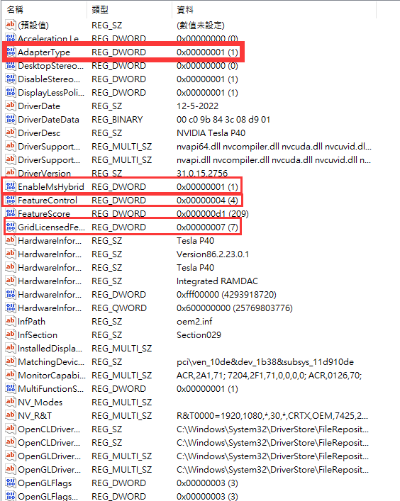

English | [繁體中文](README_TCH.md)
# How to Use Tesla P40
A guide to help you use the Tesla P40. The author encountered many problems during the installation of the P40, which is why they wrote this installation guide. Hopefully, it can help users who want to use the P40.

  

## Why Choose P40?
The P40 is a graphics card with computing power close to that of the 1080, which is not particularly remarkable, but it has 24GB of memory, which is a level that is difficult for most consumer cards on the market to reach. Although the computing power itself may not keep up with the times, it is a highly recommended entry-level card for AI training and use due to its low price and cost-effective memory, which can support most AI models provided online.


## Pros and Cons
* Pros
  * Large memory capacity (24GB)
  * Relatively low price
  * Suitable for AI training
* Cons
  * Not too high computing power
  * No external display interface
  * No active cooling
  * Requires some hands-on skills and patience
  * (Most) no warranty
## Prerequisites
Before you start, you may need to prepare some things.

A graphics card for displaying on the screen, a power supply large enough, a motherboard with ATX version recommended that can accommodate two graphics cards, two extra 6+2pin power supply interfaces, and an 8pin adapter interface for the P40. Additionally, it is recommended that you prepare cooling equipment because the P40 does not have active cooling and requires self-modification.


8(6+2) pin to 8 pin adapter

The hardware that the author prepared includes a 1200w Corsair power supply, a GTX 1080ti graphics card for display, and a P40 with a self-made cooling fan.

  

Regarding the system, it is recommended to use at least Windows 10 or a newer version. The author uses the latest version of Windows 11.

Before starting, it is necessary to change the BIOS settings to enable the detection of multiple graphics cards, otherwise the motherboard will give an error message.

### BIOS Settings
Before installing the P40, please remember to modify the BIOS settings:

* Enable Above 4G memory
    * This option enables the motherboard to detect multiple graphics cards.
* Disable CSM
    * If not disabled, the Nvidia graphics card selection will give an error message.
After setting, please remember to save and shut down.
## Installing P40
Please install the P40 in the graphics card slot, and then try to enter the system. If you can enter the system, please proceed to the next step. If you cannot enter the system, please:

1. Check if the motherboard supports multiple graphics cards or Nvidia graphics cards.
2. Check if there is any problem with the power supply. The adapter should be two 6+2 pin connectors totaling 16 pins to 8 pins.
3. Check if the slot is properly inserted.
If the above cannot solve your problem, you can raise it in Issues and let us help you figure it out.

After entering the system
Please note that the following is an example using the Windows system, and this article is based on Win11 as the testing environment.

You may need to install Nvidia drivers. Here, the advantage of using the 1080ti is already evident. Because the P40 and 1090 use equal chips and architecture, the drivers can be interchanged. Of course, you can choose to install the studio version of the 1080 or Titan driver.

After installing the driver, you may notice that the Tesla P40 graphics card is not detected in the Task Manager. Therefore, you need to modify the registry.

Please press ```WIN + R``` to open the Run window, then enter ```regedit``` to get into register table, and then enter ```HKEY_LOCAL_MACHINE\SYSTEM\ControlSet001\Control\Class\{4d36e968-e325-11ce-bfc1-08002be10318}\0001 ``` in path to modify its content.
* Modify AdapterType to 1
* Modify FeatureScore to d1

Add Dword:

* Fill in 1 for EnableMsHybrid
* Fill in 7 for GridLicensedFeatures



After modifying the registry, you can choose to restart or disable and enable P40 in the device manager to see that P40 has been successfully called in the Task Manager.


## How to use the P40 graphics card?
After completing the above, you may still be curious about how to use this graphics card.

You can open Settings, Display, Graphics, add an application, and then edit it to specify P40 to run a specific .exe application.

The following will use Stable Diffusion WebUI as an example:


