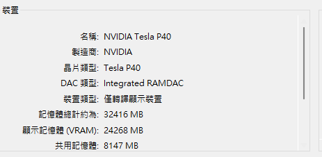
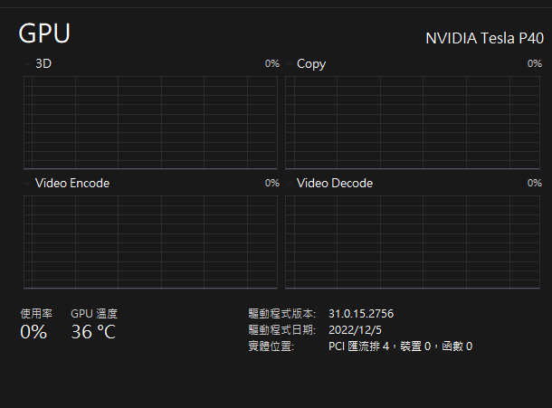

[English](README.md) | 繁體中文
# 如何使用 Tesla p40
  一篇幫助你使用 Tesla p40 的手冊。筆者在拿到 p40 後，安裝上也遇到許多問題，所以才寫了這篇安裝手冊。希望能幫助到想使用 p40 的使用者們。
  
  

## 為什麼選 p40 ？
  p40 是一張算力接近於 1080 的顯卡，這點並非特別耀眼，但其具備有 24G 的顯存。是市面上大部分民用卡很難企及的一個量級。雖然算力本身可能跟不上時代的步伐，但架不住價格比較低廉以及其顯存的性價比，作為 AI 訓練和使用上，這是一張很推薦的入門卡，可以支撐大部分網上所提供的 AI 模型。
  
  

## 優缺點
  * 優點
    * 大容量顯存(24G)
    * 較為低廉的價格
    * 適合 AI 訓練
  * 缺點
    * 不算太高的算力
    * 沒有外接的顯示接口
    * 沒有主動散熱
    * 需要一定的動手能力和耐性
    * (大部分)沒有保固

## 前置
  在開始前，你可能需要準備一些東西

  一張給屏幕顯示的顯示用顯卡，足夠大的電源，建議主板使用 ATX 的版本，可以放下兩張顯卡，以及兩個多餘的 6+2pin 電源接口和 p40 用的轉接 8pin 接口；額外建議，希望能備好散熱，因為 p40 並沒有主動散熱的方式，需要自己動手改裝。
  
  
  > 雙 8(6+2) pin 轉 8 pin 的轉接頭

  筆者所準備的硬件為 1200w 的海盜船電源，GTX 1080ti 顯卡作為顯示用顯卡，以及 p40 和 自制的散熱風扇。
  
  
  
  系統方面推薦至少 win10 以上，使用最新的版本。筆者使用的是 win11 的最新版本。
  
  開始前，也需要先更改 bios 設定以啟用多張顯卡的判別，否則主板將進行報錯。
### BIOS 設定
在裝上 p40 前請先記得修改 bios 設定
  * 開啟 Above 4G memory
    * 這個選項會啟用主板對多張顯卡的判定
  * 關閉 CSM 
    * 不關閉則 Nvidea 的顯卡選擇會進行報錯
  設定完後請記得儲存後關機。
  
 ## 安裝 p40
 請將 p40 安裝在顯卡的插槽上，然後嘗試看看能不能進入系統，若進入系統請進行下一步。如若不能進入系統請：
 1. 請檢查主版有沒有支援多顯卡或是支援 Nvidia 的顯卡
 2. 請檢查供電有沒有問題，轉接頭應該是兩個 6+2 的 pin 總計 16 pin 轉 8pin
 3. 請檢查插槽有沒有插好

如若上面這些都沒辦法解決你的問題，可以在 Issues 中提出，大家一起來幫你想辦法。

## 進入系統後
請注意，以下皆以 windows 系統為例，本文是以 win11 作為測試環境。

你可能需要安裝 Nvidia 的驅動，這裡筆者使用 1080ti 的好處便已體現。由於 p40 和 1090 採用相等的晶片和架構，所以驅動能夠互通。當然你可以選擇安裝 1080 或 titan 的 studion 版本的驅動。

安裝好驅動後，可以注意到工作管理員並沒有讀取到 tesla p40 顯卡。所以接下來需要更改註冊表

請按 ```WIN + R``` 開啟執行，然後輸入 ```HKEY_LOCAL_MACHINE\SYSTEM\ControlSet001\Control\Class\{4d36e968-e325-11ce-bfc1-08002be10318}\0001``` 更改其中的內容。
* ```AdapterType``` 修改成 1
* ```FeatureScore``` 修改成 d1
新增 Dword:
* ```EnableMsHybrid``` 填入 1
* ```GridLicensedFeatures``` 填入 7


修改完註冊表後，可以選擇重新開機或在裝置管理員中選中顯示卡將 p40 停用後啟用，就能夠在工作管理員中看到 p40 已經被成功調用。



## 如何調用 p40 顯卡？
完成上面這些，你可能還是很好奇，我們到底要怎麼使用這張顯卡。

可以打開設定，顯示器，圖形，新增應用程式然後編輯來指定 p40 來跑特定的 .exe 應用程式。

以下將以 stable diffusion webui 作範例：


